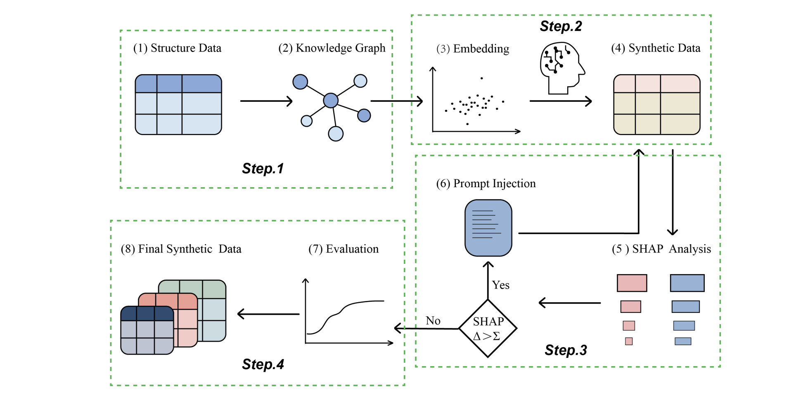

# KGSynX

> Knowledge Graph and Explainable Feedback Guided LLMs for Synthetic Tabular Data Generation

[](https://ceur-ws.org/Vol-4085/paper34.pdf)
[](LICENSE)
[](https://www.python.org)

KGSynX integrates knowledge graphs and SHAP-driven explainable feedback to steer LLMs in generating high-fidelity synthetic tabular data. The framework iteratively refines generation prompts based on attribution-gap diagnostics, producing synthetic datasets that preserve both statistics and decision-logic semantics of the original data.

---

## Method

KGSynX is a four-step pipeline:

1. **KG Construction** — Lift raw tables into a knowledge graph where each row is an entity node and each feature-value pair is an attribute node linked via typed relations.
2. **Embedding & Initial Synthesis** — Compute Node2Vec embeddings on the KG and inject these structure-aware vectors into prompts for GPT-4o.
3. **SHAP Analysis & Prompt Feedback Loop** — Train classifiers on real and synthetic data, use SHAP to measure feature-importance gaps, translate these gaps into targeted prompt edits, and repeat until convergence.
4. **Final Optimized Synthetic Data Generation** — Produce the final synthetic dataset matching the real data in both statistics and decision-logic semantics.



---

## Results

Evaluated under the **Train-on-Synthetic, Test-on-Real (TSTR)** protocol on three benchmark datasets:

| Method     | Heart Disease (Acc / F1 / AUC) | Enterprise Invoice (Acc / F1 / AUC) | Telco Churn (Acc / F1 / AUC) |
|------------|--------------------------------|--------------------------------------|------------------------------|
| Real       | 0.867 / 0.826 / 0.929          | 0.867 / 0.826 / 0.929                | 0.833 / 0.713 / 0.867        |
| MedGAN     | 0.664 / 0.384 / 0.527          | 0.725 / 0.724 / 0.818                | 0.730 / 0.515 / 0.294        |
| CTGAN      | 0.667 / 0.474 / 0.746          | 0.655 / 0.670 / 0.628                | 0.726 / 0.332 / 0.557        |
| TabDDPM    | 0.541 / 0.380 / 0.498          | 0.425 / 0.357 / 0.544                | 0.721 / 0.603 / 0.772        |
| LLM        | 0.350 / 0.361 / 0.278          | 0.765 / 0.766 / 0.838                | 0.626 / 0.584 / 0.810        |
| LLM + KG   | 0.600 / 0.625 / 0.741          | 0.865 / 0.868 / **0.943**            | 0.760 / 0.326 / 0.824        |
| **KGSynX** | **0.767 / 0.750 / 0.827**      | **0.900 / 0.904** / 0.942            | **0.776 / 0.611 / 0.853**    |

---

## Repository Structure

```
KGsynX/
├── src/
│   ├── data_loader.py        # Load and preprocess datasets
│   ├── kg_builder.py         # Construct entity–attribute knowledge graph
│   ├── embedding.py          # Node2Vec embeddings on the KG
│   ├── prompt_utils.py       # Prompt construction helpers
│   ├── shap_analysis.py      # SHAP attribution computation
│   └── baseline-TABGAN.py    # TabGAN baseline for comparison
├── modules/
│   ├── shap_guided_generator.py   # SHAP-feedback prompt refinement
│   └── iterative_refinement.py    # Closed-loop generation driver
├── utils/
│   └── sdata_gen.py          # Synthetic data generation utilities
├── data/
│   ├── heart+disease/        # UCI Heart Disease dataset
│   ├── infomart/             # Enterprise invoice (proprietary)
│   └── telco/                # Telco Customer Churn dataset
├── requirements.txt
├── LICENSE
└── README.md
```

---

## Setup

### 1. Clone the repo

```bash
git clone https://github.com/keith991001/KGsynX.git
cd KGsynX
```

### 2. Install dependencies

```bash
pip install -r requirements.txt
```

### 3. Configure your OpenAI API key

KGSynX uses GPT-4o as the synthesis LLM. Set your key as an environment variable:

```bash
export OPENAI_API_KEY="sk-..."
```

---

## Quick Start

Run the iterative refinement pipeline on the UCI Heart Disease dataset:

```bash
python -m modules.iterative_refinement
```

This will:
1. Load and preprocess the Heart Disease dataset.
2. Build the patient-level knowledge graph.
3. Compute Node2Vec embeddings.
4. Generate an initial batch of synthetic samples via GPT-4o.
5. Run the SHAP-guided refinement loop until convergence (default: 5 rounds or attribution gap < 0.1).

---

## Datasets

| Dataset | Source | License |
|---------|--------|---------|
| UCI Heart Disease | https://archive.ics.uci.edu/dataset/45/heart+disease | Public domain |
| Enterprise Invoice | Provided by Infomart Corporation | Proprietary, not redistributed |
| Telco Customer Churn | https://www.kaggle.com/datasets/blastchar/telco-customer-churn | IBM Sample Data |

---

## Citation

If you find KGSynX useful in your research, please cite:

```bibtex
@inproceedings{yu2025kgsynx,
  author    = {Yu, Ke and Ishikura, Shigeru and Usukura, Yukari and Shigoku, Yuki and Hayashi, Teruaki},
  title     = {KGSynX: Knowledge Graph and Explainable Feedback Guided LLMs for Synthetic Tabular Data Generation},
  booktitle = {ISWC 2025 Companion Volume},
  year      = {2025},
  publisher = {CEUR Workshop Proceedings},
  volume    = {4085},
  url       = {https://ceur-ws.org/Vol-4085/paper34.pdf}
}
```

---

## Acknowledgments

This work was supported by the joint research project with **Infomart Corporation** and **JST PRESTO Grant Number JPMJPR2369**.

---

## License

MIT License — see [LICENSE](LICENSE) for details.

The synthetic data generation pipeline, source code, and reproducible scripts are released under MIT. Proprietary datasets (Enterprise Invoice) are not redistributed with this repository.
